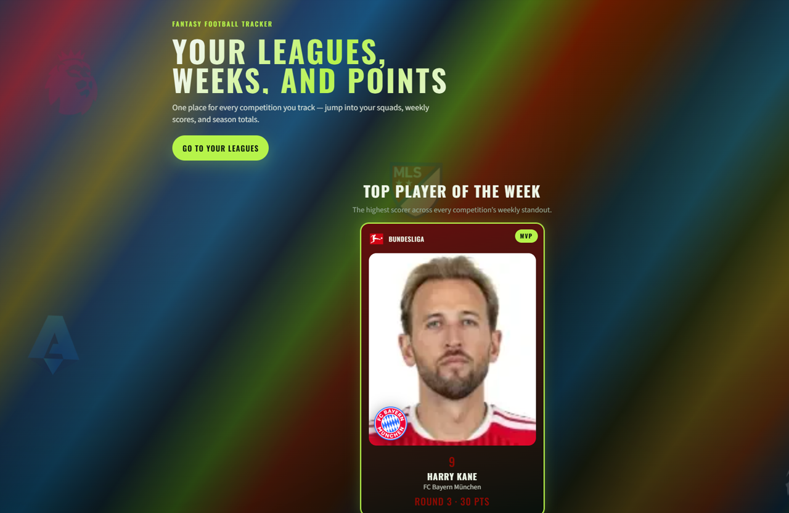
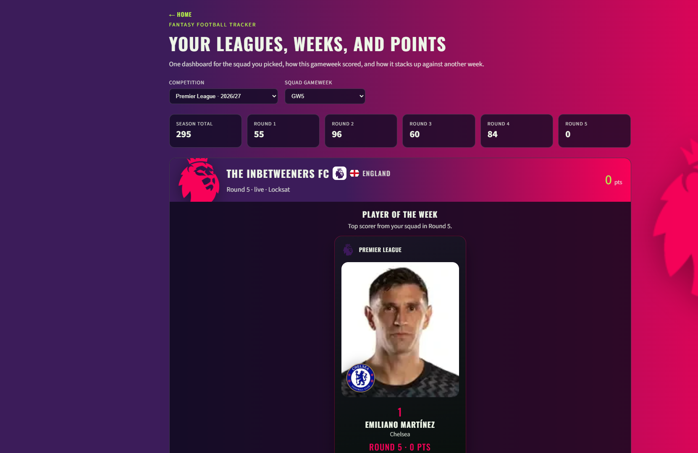
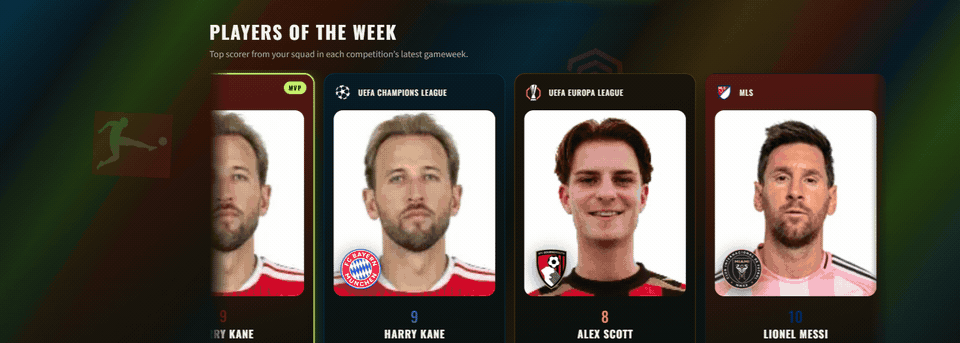
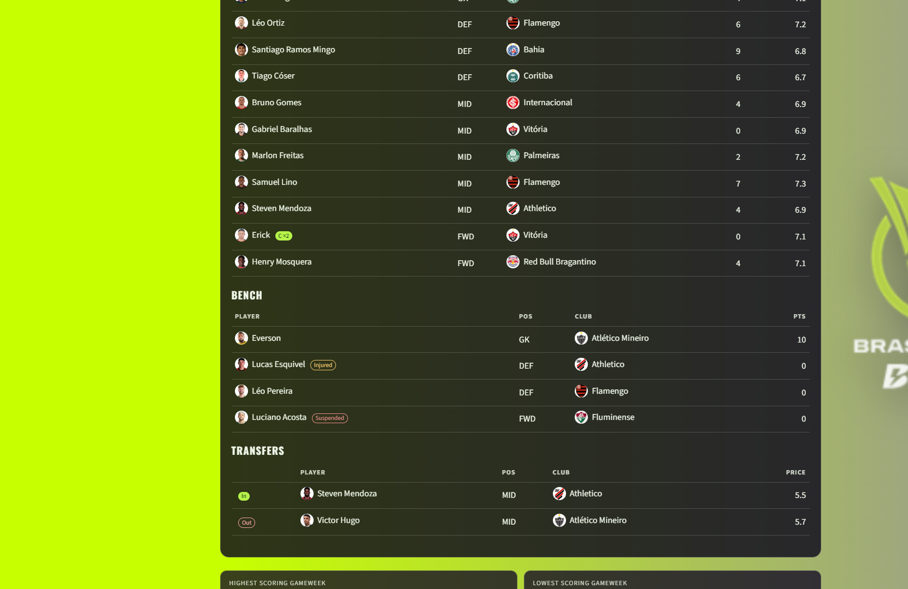
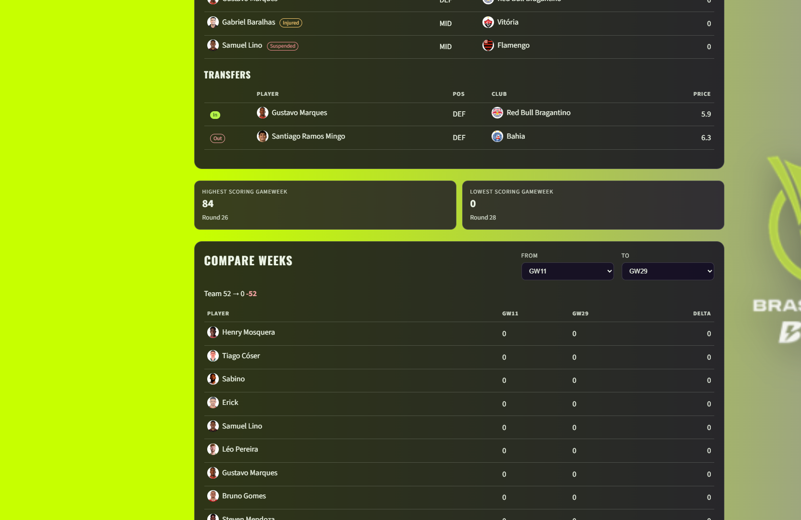
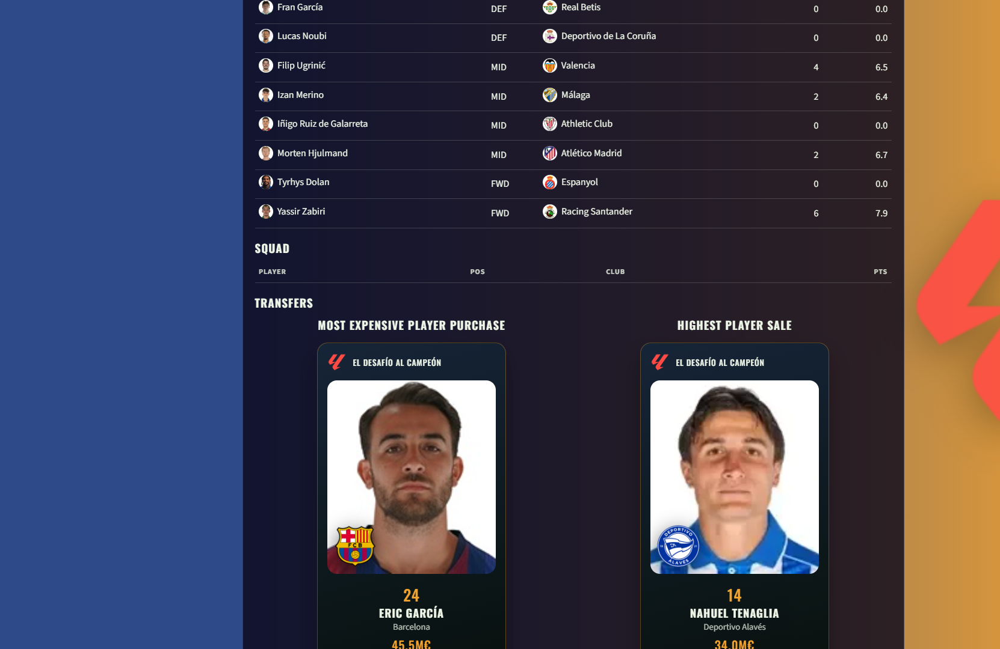

# Fantasy Football Tracker

[](https://angular.dev/)
[](https://www.typescriptlang.org/)
[](https://spring.io/projects/spring-boot)
[](https://openjdk.org/)
[](https://www.mysql.com/)
[](https://www.python.org/)
[](https://gsap.com/)

Personal SofaScore Fantasy tracker: Python collector → Spring Boot + MySQL → Angular dashboard.

The dashboard shows your squad, captain chips, club crests, player portraits, week-vs-week compare, season totals, transfers, **Injured** / **Suspended** status chips, and season high/low gameweek cards (lowest excludes unfinished open shells). The homepage adds Players of the Week plus **latest-week** and **Europe / Americas season** league tables. Official LaLiga Fantasy (Desafío) also highlights most expensive purchase / highest sale, **Longest serving player**, and market **Total sold / Total bought** plus manager-table footers.

## Screenshots

Homepage with MVP and competition wash:



Competition dashboard (squad, totals, player of the week):



Players of the week marquee (GSAP — pauses on hover):



Injured / Suspended chips on the squad (per gameweek, from SofaScore lineups):



Highest and lowest scoring gameweeks (season extremes, beside Compare weeks):



Official LaLiga — most expensive purchase and highest sale (POTW-style cards in Transfers):



Homepage league tables (latest week + regional season totals):

League standings live on `/` under Players of the week (API: `latestWeekStandings`, `europeTotalStandings`, `americasTotalStandings`).

## Layout

- `backend/` — Spring Boot 3.5 API (`/api/v1`)
- `frontend/` — Angular 21 dashboard
- `collector/` — Python ingest CLI (local Network JSON, optional SofaScore URLs)
- `sql/schema.sql` — MySQL schema (gameweeks are **rows**, not tables)

`.env` and `.env.example` are gitignored. Keep a local `.env.example` as a template and copy it to `.env` for tokens or SofaScore session values. Never commit `.env` or personal SofaScore JSON.

## Run locally

Personal data lives in MySQL (XAMPP / MariaDB on port **3307**, database `fantasy_tracker`). Do not start XAMPP Tomcat on 8080 — it conflicts with Spring Boot.

```bash
mysql -u root -P 3307 < sql/schema.sql
cd backend
mvn spring-boot:run -Dspring-boot.run.profiles=mysql
```

```bash
cd frontend
npm start
```

Dashboard: http://localhost:4200  
API: http://localhost:8080/api/v1/competitions

H2 + seed JSON (`Sofa Saints`) is still the default if you run the backend with no profile. That path is for tests / a first boot without MySQL.

## Collector

Copy Firefox Network JSON from your own logged-in SofaScore Fantasy session (Persist Logs + XHR), **or** paste those same XHR URLs plus your session cookie into `.env` and run `pull`.

```bash
cd collector
python -m pip install -r requirements.txt

python -m collector import path\to\premier-league-squad.json --meta path\to\premier-league.json
python -m collector import path\to\premier-league-transfers.json --meta path\to\premier-league.json

python -m collector pull --dry-run
python -m collector pull --competition laliga --dry-run
python -m collector pull --competition premier-league-fantasy
python -m collector pull
```

Weekly Windows task (Monday 21:00): `powershell -ExecutionPolicy Bypass -File collector\register-weekly-task.ps1`

The collector POSTs to Spring Boot. It does not log in or scrape the site. `pull` fetches every competition that has URLs in `.env` (Premier League, LaLiga, Serie A, Ligue 1, Bundesliga, Champions League, Europa League, Nations League, MLS, Brasileirão) plus official Premier League Fantasy when `FPL_ENTRY_ID` is set and official WSL Fantasy when `WSL_GAME_TOKEN` + `WSL_GAMEPLAY_ID` are set. HTTP 401 means refresh `SOFASCORE_SESSION` (SofaScore) or `WSL_GAME_TOKEN` (`x-game-token` from the my-team XHR, not Auth0 Bearer). Official FPL uses the public JSON API (team id from `/entry/{id}/event/1`); no cookie. Official LaLiga Fantasy is app-only (100M€ market, starting XI + squad, independent buys/sells, no captains): fill `collector/templates/laliga-fantasy-oficial.xlsx` and run `python -m collector import-excel`.

## Scoring and media

- SofaScore `fixtures[].score` is **raw**. Captain display is ×2, triple captain is ×3. Team week totals stay SofaScore’s `userRound.score` (already includes the chip). Official WSL `totalPoints` already includes captain ×2; the collector stores the raw half so the dashboard does not double it again.
- Crests: SofaScore `https://img.sofascore.com/api/v1/team/{id}/image`; official FPL uses Premier League badge `t{code}.png`
- Portraits: SofaScore `https://img.sofascore.com/api/v1/player/{id}/image` (official FPL maps names onto the Premier League season player list; official WSL maps onto unique-tournament 1044)
- Competition logos: `https://img.sofascore.com/api/v1/unique-tournament/{id}/image` (same endpoint the main SofaScore tournament page uses; Champions League is 7, Europa League is 679, Nations League is 10783, MLS is 242, Brasileirão is 325, WSL is 1044)
- Transfers: official SofaScore transfers JSON (paired in/out per round). Squad-diff is only a fallback if a week has no official rows.
- **Injured / Suspended:** per-GW from SofaScore event lineups `missingPlayers` (injury vs yellow accumulation / red card / unavailable). Stored on `squad_pick` and shown as chips next to the player name.
- **Season extremes:** Highest / Lowest Scoring Gameweek cards are derived from `GET …/totals` on the competition page. **Lowest** only considers finished weeks (or live weeks that already posted points &gt; 0), so open 0-pt shells like “GW6 not started” do not win.
- **Homepage league tables:** `GET /api/v1/home` returns `latestWeekStandings` (ranked by each competition’s latest scored GW points) plus `europeTotalStandings` / `americasTotalStandings` (season totals; Americas = MLS + Brasileirão).
- **Official LaLiga deal highlights:** season max `priceIn` / `priceOut` from `gameweek_transfer` (Most expensive player purchase / Highest player sale).
- **Longest serving player (Desafío):** most gameweeks with `role=starter`; ties broken by total starter points. Card sits between squad and transfers.
- **Market totals (Desafío):** UI adds **Total sold** / **Total bought** (market + release-clause sides) for This gameweek and Season, plus footer totals on the manager counterpart tables.
- **Desafío shirts:** Excel `import-excel` fills `shirtNumber` from SofaScore `player/{id}` `jerseyNumber` when the workbook has a numeric SofaScore player id.

## API

- `GET /api/v1/home`
- `POST /api/v1/ingest/snapshots`
- `POST /api/v1/ingest/transfers`
- `GET /api/v1/competitions`
- `GET /api/v1/competitions/{id}/team?gameweek=`
- `GET /api/v1/competitions/{id}/gameweeks/{n}`
- `GET /api/v1/competitions/{id}/compare?from=1&to=2`
- `GET /api/v1/competitions/{id}/totals`

## Deploy / hosting

This app is **not published to Hostinger** (shared PHP hosting cannot run Spring Boot + MySQL as designed). Production was planned for an **IONOS Linux VPS** (SSH: MariaDB + JVM + nginx static Angular; collector stays on the PC). There is no live public URL yet — local dashboard remains `http://localhost:4200`.
